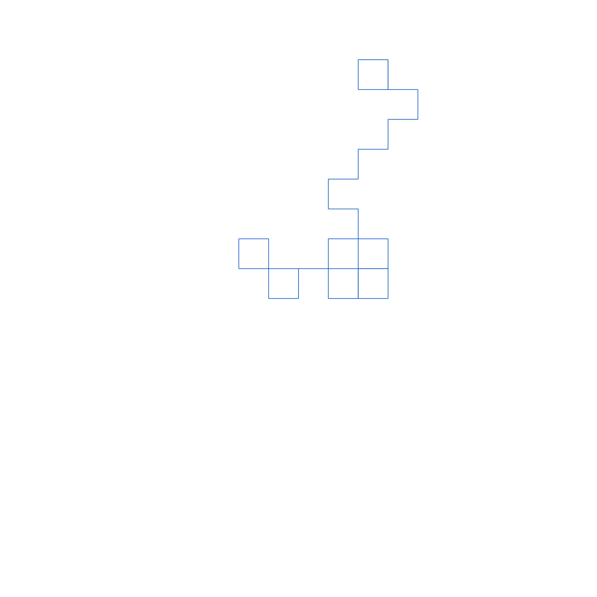

<h1 align="center">RL-path</h1>

### Task

To draw a path for given turns (left and right) in SVG

### Code

```python
# from os import system as show
import random


DIRECTIONS = ((1, 0), (0, 1), (-1, 0), (0, -1))


def draw_RL(width, height, n):
    x = width / 2
    y = height / 2
    direction = 0
    result = []

    new_x, new_y = x, y - step_length

    result.append("<line x1=\"{}\" y1=\"{}\" x2=\"{}\" y2=\"{}\" stroke=\"{}\" />".format(
        x, y,
        new_x, new_y,
        color
    ))

    for i in range(len(s)):

        if s[i] == "R":
            direction = (direction + 1) % 4
        else:
            direction = 3 if direction == 0 else direction - 1

        new_y += DIRECTIONS[direction][0] * step_length
        new_x += DIRECTIONS[direction][1] * step_length

        result.append("<line x1=\"{}\" y1=\"{}\" x2=\"{}\" y2=\"{}\" stroke=\"{}\" />".format(
            x, y,
            new_x, new_y,
            color
        ))

        x, y = new_x, new_y

    return result


width, height = 1000, 1000
step_length = 50
color = "#0053e0"


# s = list(input("s = "))
s = [random.choice(['R', "L"]) for _ in range(random.randint(5, 100))]


svg = """
<?xml version="1.0" encoding="utf-8"?>
<svg version="1.1" xmlns="http://www.w3.org/2000/svg" xmlns:xlink="http://www.w3.org/1999/xlink" viewBox="0 0 {} {}">
{content}
</svg>
""".format(
    width, height,
    content="\n".join(['\t' + line for line in draw_RL(width, height, s)]).strip()
)

with open("RL-path.svg", 'w', encoding="utf-8") as file:
    file.write(svg.strip())

# Show result:
# show("RL-path.svg")
```

### Result

```xml
<?xml version="1.0" encoding="utf-8"?>
<svg version="1.1" xmlns="http://www.w3.org/2000/svg" xmlns:xlink="http://www.w3.org/1999/xlink" viewBox="0 0 1000 1000">
<line x1="500.0" y1="500.0" x2="500.0" y2="450.0" stroke="#0053e0" />
	<line x1="500.0" y1="450.0" x2="450.0" y2="450.0" stroke="#0053e0" />
	<line x1="450.0" y1="450.0" x2="450.0" y2="400.0" stroke="#0053e0" />
	<line x1="450.0" y1="400.0" x2="400.0" y2="400.0" stroke="#0053e0" />
	...
	<line x1="650.0" y1="150.0" x2="650.0" y2="100.0" stroke="#0053e0" />
	<line x1="650.0" y1="100.0" x2="600.0" y2="100.0" stroke="#0053e0" />
</svg>
```

