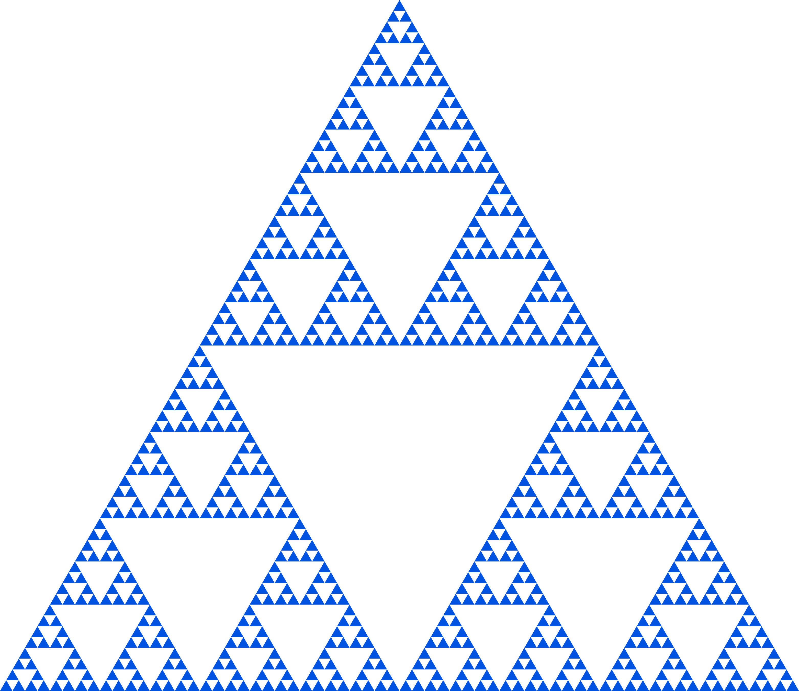

<h1 align="center">Sierpinski triangle</h1>

### Task

To draw the [Sierpinski triangle](https://en.wikipedia.org/wiki/Sierpi%C5%84ski_triangle "Visit wikipedia.org") in SVG

### Code

```python
# from os import system as show

def draw_serpinsky(x, y, width, height, n):
    if n == 1:
        return """<polygon points="{},{} {},{} {},{}" fill="{}" />""".format(
            x, y + height,
            x + width / 2, y,
            x + width, y + height,
            color
        )

    top = draw_serpinsky(x + width / 4, y, width / 2, height / 2, n - 1)
    left = draw_serpinsky(x, y + height / 2, width / 2, height / 2, n - 1)
    right = draw_serpinsky(x + width / 2, y + height / 2, width / 2, height / 2, n - 1)

    return """\t{}\n\t{}\n\t{}""".format(top, left, right).strip()


width = 1000
height = width * 3**(1 / 2) / 2
color = "#0053e0"

n = int(input("n = "))

svg = """
<?xml version="1.0" encoding="utf-8"?>
<svg version="1.1" xmlns="http://www.w3.org/2000/svg" xmlns:xlink="http://www.w3.org/1999/xlink" viewBox="0 0 {} {}">
{content}
</svg>
""".format(width, height, content=draw_serpinsky(0, 0, width, height, n))

with open("Треугольник Серпинского.svg", 'w', encoding="utf-8") as file:
    file.write(svg.strip())

# Show result:
# show("Треугольник Серпинского.svg")
```

### Result

For `n = 7`:

```xml
<?xml version="1.0" encoding="utf-8"?>
<svg version="1.1" xmlns="http://www.w3.org/2000/svg" xmlns:xlink="http://www.w3.org/1999/xlink" viewBox="0 0 1000 866.0254037844386">
<polygon points="492.1875,13.531646934131853 500.0,0 507.8125,13.531646934131853" fill="#0053e0" />
	<polygon points="484.375,27.063293868263706 492.1875,13.531646934131853 500.0,27.063293868263706" fill="#0053e0" />
	<polygon points="500.0,27.063293868263706 507.8125,13.531646934131853 515.625,27.063293868263706" fill="#0053e0" />
	<polygon points="476.5625,40.594940802395556 484.375,27.063293868263706 492.1875,40.594940802395556" fill="#0053e0" />
	<polygon points="468.75,54.12658773652741 476.5625,40.594940802395556 484.375,54.12658773652741" fill="#0053e0" />
	...
	<polygon points="968.75,866.0254037844385 976.5625,852.4937568503067 984.375,866.0254037844385" fill="#0053e0" />
	<polygon points="984.375,866.0254037844385 992.1875,852.4937568503067 1000.0,866.0254037844385" fill="#0053e0" />
</svg>
```

